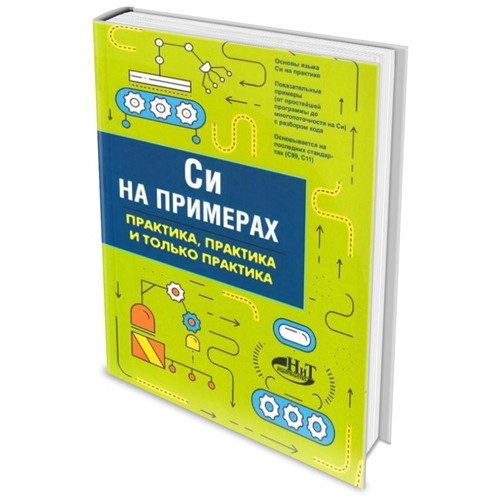

# Кольцов Д.М. - "Си на примерах"
Исходные коды некоторых примеров из книги

### Содержание:

[Глава 8. Очереди и стеки](./ch08)

[Глава 9. Связанные списки и деревья](./ch09)

[Глава 10. Алгоритмы поиска и сортировки](./ch10)
